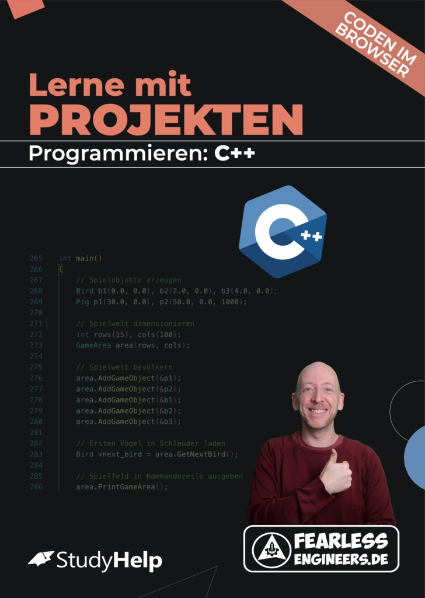
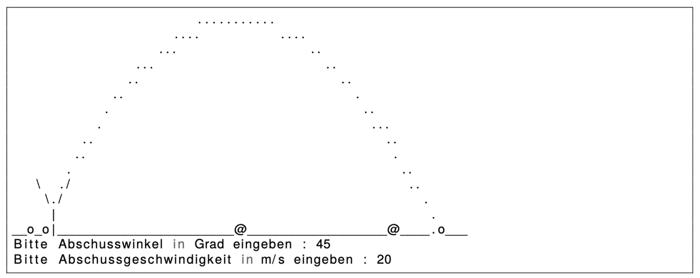

# Spiel: Wütende Vögel im Terminal - Ein Projekt für Anfänger in C++

Du kannst alle Code-Listings direkt in deinem Browser ausführen unter [FearlessEngineers.de](https://www.fearlessengineers.de).

Eine ausführliche Beschreibung aller Code-Listings inkl. der nötigen Programmier-Basics findest du im folgenden Lernheft: 

**Worum geht es?**

In vielen Kursen zum Einstieg in die Programmierung werden die einzelnen Konzepte in einer festen Reihenfolge eingeführt: Meistens geht es los mit einer ausführlichen Einführung in Datentypen und Operatoren sowie Dinge wie Konstanten, Typumwandlungen oder Speicherbedarf.

Das Problem mit dieser Art von Einstieg ist, dass es eine ganze Weile dauert, bis du zu spannenden Themen kommst und etwas greifbares mit deinen neuen Fähigkeiten entwickeln kannst.

Das Lernheft "Lerne Programmieren mit Projekten: C++" geht einen anderen Weg: Du lernst Programmieren an echten Projekten und wirst dir nur diejenigen Grundlagen anschauen, die für die Umsetzung des Projekts unbedingt nötig sind.

Herzlich willkommen zum dritten und letzten Projekt in diesem Kurs. In diesem Projekt wirst du mit Hilfe der "objektorientierten Programmierung ein Spiel entwickeln, das an den Klassiker "Angry Birds" angelehnt ist und bei dem Vögel mit einer Schleuder auf Schweine abgefeuert werden.

Du hast mit den ersten beiden Projekten schon einige Einblicke in die Programmierung mit C++ bekommen und bist in der Lage, erste Programme zu schreiben. Beim Projekt "Geheime Nachrichten" und auch beim "Player für ASCII-Filme" handelte es sich um *prozeduralen* Code, d.h. die Anweisungen werden nacheinander abgearbeitet.

In diesem Projekt wollen wir jetzt einen Schritt weiter gehen und die *objektorientierte Programmierung (OOP)* einführen. Dabei handelt es sich um eines der wichtigsten Konzepte von C++ (und vielen anderen Sprachen), bei der Daten und Funktionen zu Objekten zusammengefasst werden. Dadurch wird das Entwickeln deutlich vereinfacht, besonders wenn es sich um größeren Programme handelt.

**Das kannst du nach diesem Projekt:**

- Adressen von Variablen auslesen und in Zeigern speichern.
- Funktionen schreiben und Daten mit ihnen austauschen.
- Zusammengesetzte Datentypen erstellen.
- Mit objektorientiertem Code komplexere Programme entwickeln.

---

Die Umsetzung des Projekts besteht aus 4 Teilen, die im Lernheft ab Seite 97 detailliert beschrieben sind.

Fragen und Anregungen gerne an kontakt@andreashaja.com.
